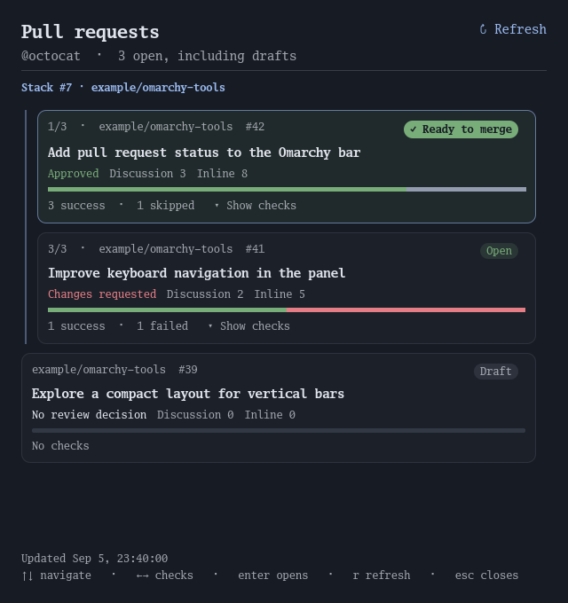

# GitHub PR Status for Omarchy

Your authored **open pull requests**, including drafts, in the Omarchy bar.
Uses the active `gh` account on **github.com**, across public and private
repositories the account can access. No repository configuration required.



## What it shows

- A PR icon, open-PR count, and running/failure/stale indicator in the bar.
- A scrollable panel, most recently updated first, with repository, PR number,
  title, Open/Draft badge, and GitHub's review decision.
- Separate **Discussion** and **Inline** comment counts. Discussion counts PR
  conversation comments. Inline counts submitted code-review comments and replies,
  including resolved/outdated discussions and dismissed reviews. Pending review
  comments and review summary text are excluded.
- A proportional check bar. Click its summary, or use Left/Right, to see the
  individual check names and original GitHub statuses.

| Bar segment | GitHub statuses |
| --- | --- |
| Running | Queued, pending, waiting, requested, expected, in progress |
| Success | Success |
| Skipped | Skipped, neutral, cancelled |
| Failed | Failure, error, timed out, action required, startup failure, stale |
| Unknown | Unrecognized or unavailable status |

No checks is distinct from success. Unknown statuses have a labelled gray segment.
Cancellation stays visible as `CANCELLED` in the expanded details.
Review decisions are Approved, Changes requested, Review required, or No review
decision; they do not claim the PR is mergeable.

## Requirements

- Omarchy with the Quattro plugin runtime (tested with 4.0.2).
- Python 3.10+ (standard library only) and GitHub CLI `gh` on the shell's PATH.
- A working `gh auth login --hostname github.com` session.

No additional daemon, token configuration, Python packages, or elevated privileges
are required. The plugin uses `gh api` for read-only requests; it never posts,
reviews, merges, or changes pull requests.

## Install

Run inside your Omarchy session:

```sh
omarchy plugin add https://github.com/victorhsb/omarchy-github-pr-status --enable
```

The widget appears in the right bar section. Sign in with
`gh auth login --hostname github.com` if you have not already done so.

To update a Git-installed copy:

```sh
omarchy plugin update torugo.github-pr-status
```

Omarchy installs and updates from the repository's default branch. Release tags
identify tested snapshots; the command above does not pin an installation to a tag.

## Install a local development checkout

Run from the checkout inside your Omarchy session:

```sh
python3 install.py --enable
```

This validates the plugin, copies its runtime files into
`~/.config/omarchy/plugins/torugo.github-pr-status/`, discovers it, and enables it
in the right bar section. Re-run to update the installed copy after editing this
checkout. Without `--enable`, the installer copies and discovers the plugin but
does not change its enabled state. Files are copied, not symlinked, as required
by Omarchy. It does not edit packaged Omarchy source.

If you previously installed a development copy, remove it with
`omarchy plugin remove torugo.github-pr-status` before using the Git installation
command. Omarchy backs up non-Git plugin folders when removing them.

## Controls

| Action | Control |
| --- | --- |
| Open/close panel | Left click the bar widget |
| Refresh | Right click widget, click Refresh, or press `r` |
| Select PR | Up/Down, `j`/`k`, or Tab/Shift+Tab |
| Expand/collapse checks | Right/Left, `l`/`h`, or click check summary/bar |
| Open selected PR in browser | Enter/Space, or click PR title |
| Close | Escape or outside click |

Shell commands use the same lifecycle:

```sh
omarchy-shell shell summon torugo.github-pr-status '{}'
omarchy-shell shell hide torugo.github-pr-status
omarchy plugin disable torugo.github-pr-status
omarchy plugin enable torugo.github-pr-status --section right
```

## Refresh and failures

Refreshes every 60 seconds, or every 20 seconds while the panel is open and checks
are running. Each widget instance reads a shared snapshot; a cross-process lock
coalesces requests from multiple monitors. Manual refreshes within three seconds
also share one fetch.

The helper resolves the active account, searches for its authored open PRs,
batches detail requests in groups of 20, and follows search, check, and review
pagination. Additional check pages remain pinned to the original head commit.
Merged/closed PRs disappear on the next successful discovery/detail refresh.
GitHub search has a 1,000-result ceiling: reaching its limit is reported as an
incomplete list rather than silently claiming to show everything.

Network failures preserve the previous snapshot and timestamp. Failed detail
requests keep old details with a stale label or show unknown values for new PRs.
Authentication failures clear cached results from the display. Account/config
changes invalidate cached data. Ordinary failures back off from one minute to
15 minutes; rate limits pause for at least 15 minutes, including manual requests.
GitHub search indexing can delay newly opened PRs appearing.

The cache is `~/.cache/omarchy-github-pr-status/` (or beneath `XDG_CACHE_HOME`).
It contains private PR metadata, numeric comment counts, check names/statuses,
timestamps, and a credential/config fingerprint for invalidation—not tokens or
comment bodies. Directory/file permissions are 700/600. No avatar downloads or
notifications are performed.

## Development and verification

GitHub Actions runs the Python tests on Python 3.10 and 3.14 for pushes and pull
requests. The QML and desktop checks below run locally against installed Omarchy;
they are not claimed as part of the hosted CI job.

```sh
python3 -m unittest discover -s tests -v
omarchy plugin validate .
python3 tests/check_qml.py
python3 tests/check_ui.py
```

`check_qml.py` prepares a temporary import map for the installed shell's `qs.*`
modules before running `qmllint`. Quickshell resolves those modules dynamically
at runtime; a bare `qmllint -I /usr/share/omarchy/shell` does not on all versions.

`check_ui.py` runs Qt Quick tests offscreen using the production content/row QML,
the installed shell's keyboard dispatcher, and isolated theme tokens. It exercises
navigation, clicks, expansion, refresh selection, empty/error states, and the
initial list-position regression. It also regenerates the dark and light previews
from fictional data. These tests do not start another Quickshell process or change
the desktop theme.

For a read-only live fetch:

```sh
python3 bin/github_pr_status.py --force
```

This prints private PR metadata, so do not paste its full output into public
issues. Tests and the preview use fictional example data.

## Remove

```sh
omarchy plugin remove torugo.github-pr-status
```

The metadata cache is left behind. Delete the `omarchy-github-pr-status` directory
under your cache directory if you also want to remove it.

## Credits

Inspired by [Jankees' GitHub Build Monitor](https://github.com/jankeesvw/omarchy-github-build-monitor).
Panel integration follows [Omarchy's plugin contract](https://plugins.omarchy.org/develop.html)
and the built-in clock. The PR data helper and presentation are written for this
plugin. MIT licensed.
